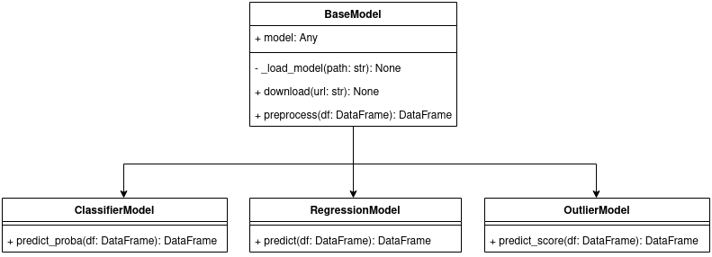

# ALeRCE Base Model

Interfaces to implement and run models of machine learning on ALeRCE Pipeline. The interfaces define the behaviour of the implementation. The following UML show the specialization for classifiers, regressors and outliers detectors. 



The only implementation in `BaseModel` is the method `download`, that download a specific file from URL to a directory:

```python
    @classmethod
    def download(cls, url: str, download_path: str = "/tmp") -> str:
        """
        Generic method to download a file from url. This method can be used for download model from S3, and after tha
        load the model to memory
        :param url: URL of downloadable file
        :param download_path: Path to store the file
        :return: Local destination path of the file
        """
        if not validators.url(url):
            raise Exception(f"{url} is not a valid url")
        if not os.path.exists(download_path):
            os.makedirs(download_path)
        filename = url.split("/")[-1]
        destination = os.path.join(download_path, filename)
        if not os.path.exists(destination):
            wget.download(url, destination)
        return 
```


# Use cases

If you want to implement a classifier:

```python

from alerce_base_model import ClassifierModel

import numpy as np
import pandas as pd


class ZerosClassifier(ClassifierModel):
    def __init__(self, path_to_model: str):
        super().__init__(path_to_model)
        self.taxonomy = ["A", "B", "C"]

    def _load_model(self, path_to_model: str) -> None:
        """
        Private method to load your model in memory. For example in torch models, you can use torch.load() for load
        the model.
        :param path_to_model: string of the path
        :return: None
        """
        self.model = None

    def preprocess(self, data_input: pd.DataFrame) -> pd.DataFrame:
        """
        Method for preprocess input data. You need to implement transformation, filters or custom processes to
        preprocess the data.
        :param data_input: DataFrame with input data
        :return: DataFrame of preprocessed input data
        """
        return data_input

    def predict_proba(self, data_input: pd.DataFrame) -> pd.DataFrame:
        """
        Predict all as zeros.
        :param data_input: Dataframe with input
        :return Predictions of the model
        """
        data_input = self.preprocess(data_input)
        probs = np.zeros((len(data_input), len(self.taxonomy)))
        response = pd.DataFrame(probs, columns=self.taxonomy)
        return response
```